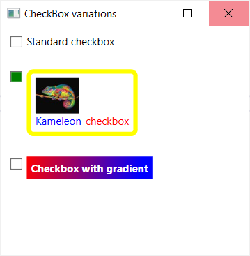

# Exercises - Chapter 1a - WPF Controls

## Exercise 1
Create a WPF application that resembles the following screenshot:

![alt text][img_exercise1]
 
The first button is a standard button.

The second button should hold an image as well as bold text with a bigger fontsize (16). The image can be found in the *images* folder.
Tip: a *StackPanel* can hold multiple controls and positions them vertically.

The bottom button must have white bold text and a gradient as background (Tip: *LinearGradientBrush*). 
The gradient must move from yellow to red to blue and finally to green with equal distance between the color transitions.

Place the buttons in a single-cell *Grid*.

Do all of this **purely in XAML**. Do not change MainWindow.xaml.cs.

## Exercise 3
Create an application that looks like the image below:

![alt text][img_exercise3]

When the *Grow* button is pressed and the button keeps being pressed down, then the rectangle keeps growing 10 pixels in width.
When the *Shrink* button is pressed and the button keeps being pressed down, then the rectangle keeps shrinking 10 pixels in width.
Position the rectangle in a canvas. 
Make sure the width of the rectangle does not shrink below zero. 
Also make sure the width of the rectangle does not exceed the edge of the canvas. 

Tip: use instances of *RepeatButton*.

## Exercise 4
Create a WPF application that resembles the following screenshot:

![alt text][img_exercise4]

The first button should be a customized *ToggleButton*. When the button is pressed the text on the button changes from "Uit" to "Aan" and visa versa.
Use a *Style* to achieve this.

Add a group of three checkboxes that enables the user to select multiple age groups. Make sure the default selection (when the application starts) matches the selection in the screenshot (checked - not checked - not checked).

Add a group of radiobuttons than enables the user to select a gender. Make sure that "Man" is checked by default (when the application starts).

All controls should be positioned in a *Canvas*.

Do all of this **purely in XAML**. Do not change MainWindow.xaml.cs.

## Exercise 5
Create a WPF application that resembles the following screenshot:

![alt text][img_exercise5]

The necessary images can be found in the *images* folder in the project for this exercise.
Use a *TreeView* control.

Do this **purely in XAML**. Do not change MainWindow.xaml.cs.
 
## Exercise 7
Create a WPF application with a *ListView* that resembles the following screenshot:

![alt text][img_exercise7]

The necessary images can be found in the *images* folder in the project for this exercise.

Do this **purely in XAML**. Do not change MainWindow.xaml.cs.

## Exercise 9
Create a WPF application that resembles the following screenshot:

The window contains a *Grid* that holds 3 checkboxes in a single cell.

The first *CheckBox* is a standard checkbox.

The second *CheckBox* has a green background and a *Border* with a *StackPanel* as content. 
The *StackPanel* shows an image of a kameleon and 2 pieces of texts below it. 
The image can be found in de *Images* folder of the project.

The *CheckBox* at the bottom contains some bold, white colored text with a linear gradient brush as background. 
The gradient brush should be *Red* on the left and should be completely *Blue* at 90% to the right.

Do all of this **purely in XAML**. Do not change MainWindow.xaml.cs.

[img_exercise1]:images/exercise1_mainwindow.png "Main window of exercise 1"
[img_exercise3]:images/exercise3_mainwindow.png "Main window of exercise 3"
[img_exercise4]:images/exercise4_mainwindow.png "Main window of exercise 4"
[img_exercise5]:images/exercise5_mainwindow.png "Main window of exercise 5"
[img_exercise7]:images/exercise7_mainwindow.png "Main window of exercise 7"

