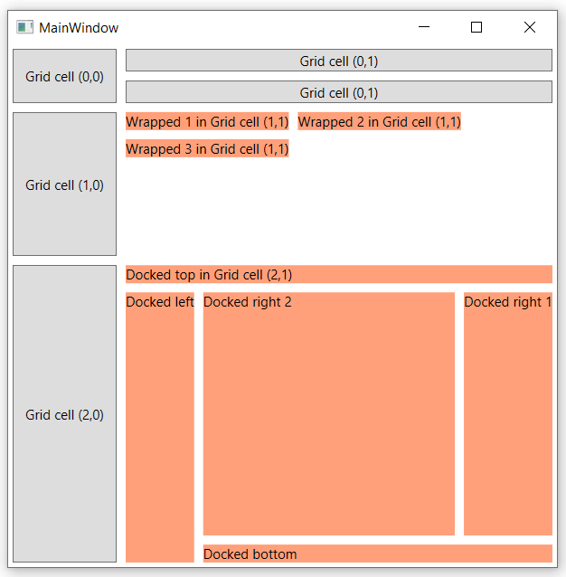
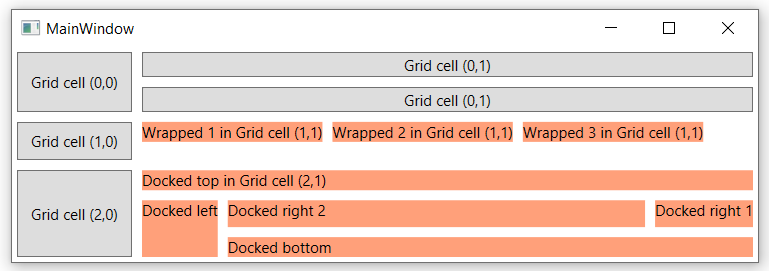
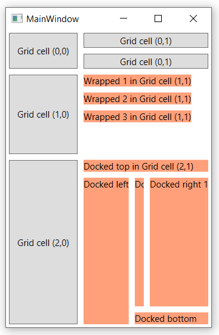
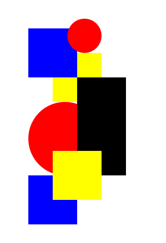
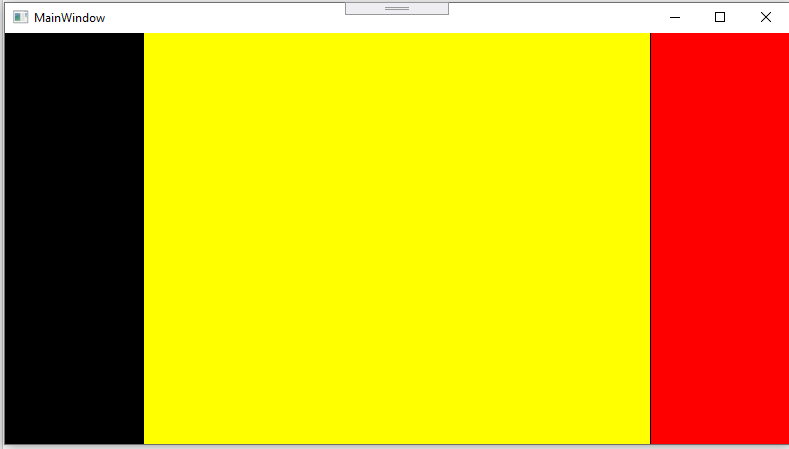
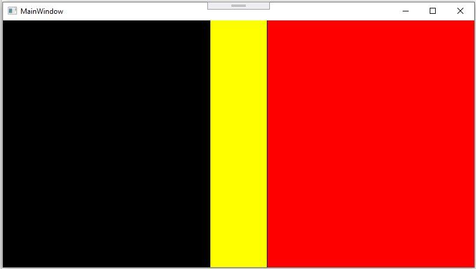
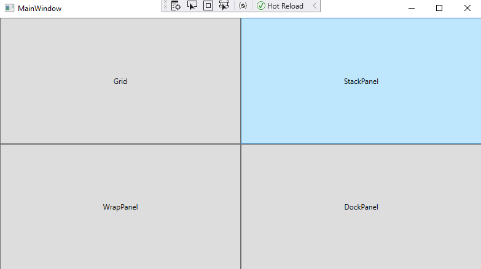
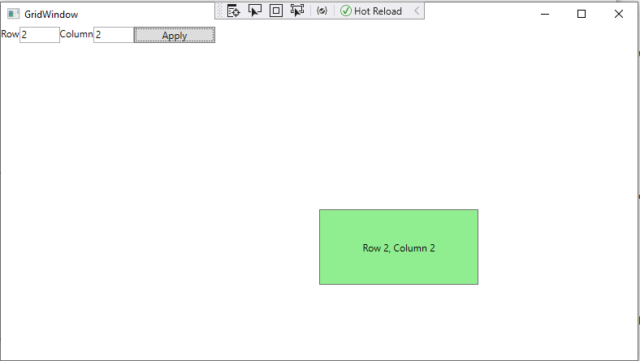
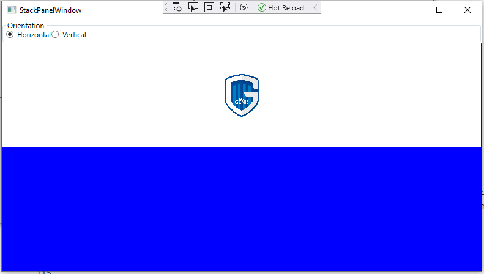

# Exercises - Chapter 2 - WPF Layout

## Exercise 1
Use XAML to create a window that looks as much as possible like this (for different window sizes):

![alt text][img_mainwindow_normal] 
![alt text][img_mainwindow_wide] 
![alt text][img_mainwindow_thin]
 
Use a *DockPanel* to display a *Grid* on the left and a button on the right.
The right *Button* should hold tree lines of text (each line in a *TextBlock*). 
Make sure there is some margin between each *TextBlock* on all sides (e.g. *Margin=4*). 
The background color of the *TextBlock* elements in the screenshot is *LightCyan*.

The *Grid* on the left has 4 cells in 2 rows and 2 columns. 
The heights of the grid rows should adjust to the height available in the parent element. 
The second row should always be 3 times higher than the first row.
The width of the first column should be an absolute amount. E.g. 100 pixels.
The with of the second column should take up the remaining space.

Both cells in the first row of the *Grid* should contain a button. 
The first cell in the second row also contains a button, but here the button is not stretched vertically. 
All other buttons in the *Window* should have their alignment set to stretch (which is the default). 
The second cell in the second row contains a *WrapPanel* that should have at least 5 *Button* controls. 
Add some padding on all sides of each button in this panel (e.g. *Padding="10"*)

Run the application and see what happens when you resize the window. 
Make sure you understand why WPF arranges the controls the way you see. 
See what happens when you use *Auto* for the width of the second column of the *Grid*.

## Exercise 2
Use XAML to create a window that looks as much as possible like this (for different window sizes):

All the *Buttons* in the UI should have some margin on all sides and use the defaults for alignment.
All the *TextBlocks* in the UI should have some margin on all sides, a non-white background color and use the defaults for alignment. 

The *Content* of the *Window* is a *Grid* with 3 rows and 2 columns.
The height of the first row should adjust to the height of its children. 
The other rows should take up the remaining available height. 
The last row should always be twice the height of the middle row.
The first column should always be 100 pixels wide.
The second column should take up the remaining width. 

The grid cells in the first column all contain one button.
The first cell in the second column contains at least 2 stacked buttons.
The second cell in the second column contains at least 2 *TextBlocks* that are positioned from left to right. If there is not enough space the next *TextBlock* is positioned below the others. 
Use a *DockPanel* to position the *TextBlocks* in the last cell of the second row.

## Exercise 3
Use XAML to create the window that looks as much as possible like this:

Use a Canvas as layout container.

Pay attention to the order of the shapes: from the top down:

Red Ellipse: top margin: 80 - left margin: 180 - diamter: 70

Blue Rectangle: top margin: 100 - left margin: 100 - width: 100

Yellow Rectangle: top margin: 150 - left margin: 150 - width: 100

Black Rectangle: top margin: 200 - left margin: 200 - width: 100

Black Rectangle: top margin: 300 - left margin: 200: width: 100

Red Ellipse: top margin: 250 - left margin: 100 - diameter 150

Yellow Rectangle: top margin: 350 - left margin: 150 - width: 100

Blue Rectangle: top margin: 400 - left margin: 100 - width: 100

## Exercise 4
Use XAML to create the window that looks as much as possible like this:

Create a Grid with 5 columns. 
The first and the last columns are resisable. When you enlarge the first column, the last column should enlarge too. There is Grid property (in combination with a GridColumn property) who can arrange this.
The middle column will take the remaining place.

When you resize the first/last column, the application will look like this.

You have to use labels in the Grid columns to add the colors in the correct order.

[img_mainwindow_normal]:images/MainWindow_normal.png "Normal"
[img_mainwindow_wide]:images/MainWindow_wide.png "Wide"
[img_mainwindow_thin]:images/MainWindow_thin.png "Thin"

## Exercise 5
Use XAML to create the winows that look as much as possible like the screenshots.

Create a MainWindow with 4 buttons that looks like this:

When you click the Grid Button, a window that looks like this, will appear:

The Grid should have 4 rows and 4 columns.

At the top of the Windows, there should be a stackPanel with 2 textblocks and textboxes, so you can enter the number of a row and a column. 
When you click the 'Apply' button, in the cell on the grid (with the cell and column number you entered), a button (with a lightgreen background) will be added.
The text 'Row <row>, Column <column>' will be shown on the button.

When you click the Stackpanel Button (on the MainWindow), a window that looks like this, should appear:

 
At the top of the Window there should be a stackpanel with 2 radio buttons. When clicking the radio buttons, you can change the orientation of the stackpanel.
 
 The StackPanel contains 2 buttons. The first button contains an image (you can choose your colours and image of your favorite team :-)
 
When you click the WrapPanel Button (on the Mainwindow), a window that looks like the screenshot, should appear:
 
 
 At the top of the Window there should be a stackpanel with 2 radio buttons. When clicking the radio buttons, you can change the orientation of the wrappanel.

 Add the ellipses to the wrappanel with the correct colors and dimensions:
 - Red - width/heigt: 100 pixels
 - Orange - width/heigt: 90 pixels
 - Yellow - width/heigt: 80 pixels
 - Lightgreen - width/heigt: 70 pixels
 - Green - width/heigt: 60 pixels
 - Lightblue - width/heigt: 50 pixels
 - Blue - width/heigt: 40 pixels
 - Black - width/heigt: 30 pixels
 
 When you click the DockPanel Button (on the MainWindow), a window that looks like the screenshot, should appear
 
 
 Position the buttons on the right position inside the DockPanel. All margins of the buttons should be 5. 
 The buttons have a height of 30 pixels and a width of 80 pixels.
 
 
